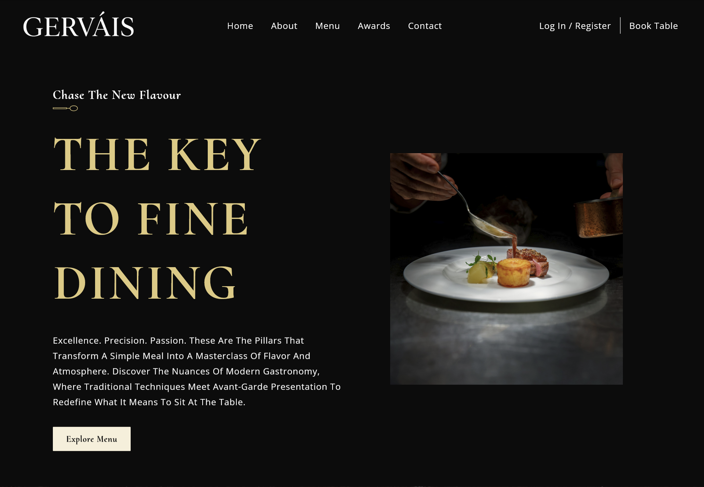

# Gervais | Fine Dining Experience

A premium, fully responsive web application built with **React**, designed to provide an immersive digital experience for a luxury dining establishment.



## Live Demo

**Check out the live version of this project here:** https://gervais-dining.netlify.app/

## Features

- **React Architecture:** Leverages a component-based structure to ensure high performance, maintainability, and a seamless single-page application (SPA) experience.
- **CSS Modules:** Implements local scoping for styles to prevent class name collisions and ensure a clean, modular, and scalable design system.
- **Lucide React Icons:** Integrated high-quality, consistent vector icons that maintain visual clarity and enhance the user interface without compromising load speeds.
- **Performance First:** Built with Vite for lightning-fast load times and optimized asset delivery.
- **Fully Responsive:** Optimized for a flawless experience across mobile, tablet, and desktop devices.

## Tech Stack

- **Frontend:** React.js
- **Build Tool:** Vite
- **Icons:** Lucide React

## Getting Started

Follow these steps to get a local copy up and running:

### Prerequisites

- **Node.js**
- **npm** or **yarn**

### Installation

1. **Clone the repository:**

```bash
git clone https://github.com/avicious/gervais-restaurant.git
```

2. **Navigate to the project directory:**

```bash
cd gervais-restaurant
```

3. **Install dependencies:**

```bash
npm install
```

4. **Start the development server:**

```bash
npm run dev
```
